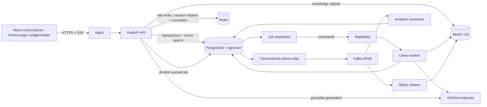

# Architecture

## System goals

Northstar separates synchronous product interactions from expensive background work and replayable analytics. PostgreSQL is the authority for user-visible state. Message systems improve latency and resilience but never become the only record of a successful user operation.

The key design properties are:

- Strict tenant ownership on every persisted and retrieved object.
- Grounded generation from explicit knowledge sources, with citations and abstention.
- Streaming responses without exposing provider reasoning internals.
- At-least-once asynchronous delivery with idempotent handlers.
- Independent scaling of HTTP, ingestion, event publication, and analytics.
- Readiness that reflects required dependencies, not merely a running process.

## Runtime topology

Compose places browser-facing services on `edge`, state traffic on the internal `data` network, and broker traffic on the internal `events` network. Stateful services with loopback-published development ports also join `local-access`, because Docker does not forward published ports from a container connected only to internal networks. Application processes do not use that network. Production deployments should remove local management port publications and the `local-access` bridge.

For local direct uploads, the API signs against the browser-reachable `S3_PUBLIC_ENDPOINT_URL`, while workers fetch the resulting key through the private `S3_ENDPOINT_URL`. Both endpoints address the same bucket. Production commonly supplies one split-horizon object-store hostname or distinct ingress/private routes with equivalent signing behavior.

## Synchronous request flow

1. Nginx serves the SPA or proxies `/api/*` to FastAPI without rewriting the API prefix.
2. Middleware assigns a request ID and security headers; CORS and route dependencies apply origin and authentication policy before tenant context is loaded.
3. Route dependencies constrain every query by tenant. Object IDs alone never authorize access.
4. Mutations and their outbox records commit in one PostgreSQL transaction.
5. The response returns once authoritative state commits; downstream analytics can follow asynchronously.

Access tokens are short lived (15 minutes in Compose). The SPA keeps only the access-token/user session in `localStorage`; production never exposes its raw refresh token to JavaScript. Login sets a host-only `northstar_refresh` cookie with `HttpOnly`, `SameSite=Strict`, `Secure`, refresh-TTL `Max-Age`, and a path limited to `${APP_API_PREFIX}/auth`. The supported production topology therefore serves the admin SPA and canonical API from the same site, normally the same origin behind Nginx.

Login records one valid token ID for a refresh family in Redis. Cookie-based refresh atomically replaces that ID and cookie; presenting an old or unexpected token deletes the family so all of its refresh tokens are rejected. Logout revokes the current access-token ID, deletes the matching cookie family, and expires the cookie. Non-production/test responses and request bodies retain raw-refresh-token support for CLI compatibility. Browser clients must not infer authorization from hidden controls; authorization is always enforced by the API.

## Public widget trust flow

Embedded and hosted widgets deliberately use separate bootstrap/session routes:

1. `public/widget.js` executes in the customer top page and requests `/widget/{publicId}/bootstrap` itself. The browser-generated `Origin` is checked against the active agent's allowlist; no `X-Widget-Origin` or origin query parameter is accepted.
2. Bootstrap mounts only a launcher. The iframe has no `src`, and no database conversation is created, until the visitor first opens it.
3. The new platform-origin iframe posts `northstar:ready`. The parent loader validates both `event.source` and `event.origin`, creates `/widget/{publicId}/sessions` from the top page, and sends bootstrap/session data to the iframe with the platform origin as the explicit `postMessage` target.
4. A reset is another nonce-correlated iframe-to-parent request and produces a fresh session. Requests with the wrong source/origin are ignored; secret-bearing replies are never posted to `*`.
5. The iframe uses the scoped bearer at `/widget/sessions/{conversationId}/messages`. The API matches its tenant, agent, and conversation claims and revalidates the captured deployment origin against the current allowlist.

The first-party `/demo/{publicId}` page instead uses `/widget/{publicId}/hosted/bootstrap` and `/widget/{publicId}/hosted/sessions`. Hosted routes require an active agent and rate-limit session creation but intentionally skip a customer-domain check; their tokens are marked as first-party hosted sessions. They must not be used by embedded installations.

## Grounded chat flow

1. Authenticate the control-plane caller or validate a scoped widget token, then validate message size, agent status, and the tenant/agent/conversation relationship.
2. Apply a Redis-backed rate limit. Production is configured to fail closed if Redis is unavailable.
3. Hash the original message for idempotency, then—when the agent's default `maskSensitiveData` control is enabled—redact provider keys, email addresses, credential values, and Luhn-valid payment-card numbers before model use and persistence.
4. Create or resume the conversation, persist the redacted user message, and load up to eight prior completed/user messages capped to the most recent 6,000 characters. Short pronoun-based follow-ups reuse the last complete user question for retrieval while the current question and history still reach generation.
5. Generate an embedding and run tenant-, agent-, approval-, and knowledge-revision-filtered hybrid retrieval. PostgreSQL ranks 2,048-dimensional `halfvec` cosine/HNSW candidates and full-text/GIN candidates independently, then combines them with reciprocal-rank fusion.
6. Reject results below the configured absolute relevance threshold and cap both candidate and context counts. Retrieval reads PostgreSQL directly; Redis is not a retrieval cache.
7. Construct a prompt in which system policy, bounded conversation history, retrieved evidence, and untrusted user content are distinct sections.
8. Consume the NVIDIA stream inside the API while discarding provider thinking/reasoning metadata and collecting only visible answer text.
9. Persist the complete assistant message and its citations, then commit an outbox event.
10. Replay the persisted, grounded answer to the client as `start`, `token`, `citation`, and `done` SSE frames.
11. The relay publishes the committed event to Kafka; analytics updates its projection idempotently.

This verified-before-SSE design deliberately favors groundedness and an atomic conversation record over upstream time-to-first-token: uncommitted provider fragments never cross the public stream, and a client disconnect cannot leave a partial assistant message marked complete. The client may show local retrieval/generation progress while awaiting the `start` frame.

## Knowledge ingestion flow

1. For files, the client computes SHA-256 over the exact bytes. The API requires that digest plus a matching filename/content type and declared size, then creates a short-lived presigned POST for a generated `staging/` key. Its signed fields bind content type, declared-size metadata, checksum metadata, and a byte range no larger than the declaration. URL sources are checked by the safe fetcher before extraction.
2. The browser copies every signed field into multipart form data and appends the file last. When source creation references the returned key, the API pins the staged version when available, reads and verifies the actual size/type/SHA-256, conditionally copies the exact ETag/version to `knowledge/`, verifies the copy size, and deletes staging. Only that validated snapshot is committed with source metadata and a queued job. A lifecycle rule expires abandoned staging versions.
3. The dispatcher claims the committed job and sends a Celery command through RabbitMQ. Failed broker publication is recorded and retried. The task ID/idempotency key is the persisted job ID.
4. A worker extracts normalized text, chunks deterministically, embeds chunks in bounded batches, replaces the source's prior chunks, and inserts the new vectors.
5. Job progress and failure detail are persisted. Retriable failures use bounded exponential backoff; permanent input failures are not retried indefinitely.
6. Completion is written with an outbox event so UI notifications and analytics observe committed state.

Workers can receive a task more than once. Retries are source-addressed and bounded. A production scale-out should additionally serialize work per source or use revision-checked upserts so two concurrent deliveries cannot race while replacing chunks.

Deleting a file source cascades its PostgreSQL chunks/facts and commits `knowledge.source.deleted.v1` in the same transaction. The object cleaner validates the event and exact `knowledge/{tenantId}/` key, checks its per-consumer `ProcessedEvent`, and purges every object version and delete marker. It marks the event processed only after the idempotent purge, so a crash retries safely. Invalid poison events enter PostgreSQL quarantine; object-store/database failures retain the Kafka offset and back off for retry.

## Messaging responsibilities

### RabbitMQ

RabbitMQ is the command plane. Celery uses it for document extraction, chunking, and embedding jobs where one worker should perform a bounded action. Delivery is at least once. Tasks acknowledge late, worker-loss rejection permits redelivery, and application retries use bounded exponential backoff. Final task failures remain visible on the persisted ingestion job. The queue declares a durable dead-letter exchange for messages rejected/dead-lettered by broker policy, but an exhausted Celery exception is normally acknowledged as failed and is not guaranteed to appear there.

Queue depth measures work backlog. Alerts should cover oldest-message age, redelivery growth, dead-letter volume, and workers with no heartbeats.

### Kafka

Kafka is the event plane. Events describe committed facts such as conversation/message creation, knowledge completion/deletion, or status changes. They are keyed by a stable aggregate identifier when ordering matters and include an immutable event ID, schema version, tenant ID, occurrence time, aggregate identity, and typed payload. Consumers validate the envelope before applying side effects. The analytics consumer stores malformed records in PostgreSQL quarantine with topic/partition/offset, a payload SHA-256, and a redacted bounded excerpt before committing their offsets; transient projection failures retain the offset for retry. The object-cleanup consumer follows the same validate/apply/deduplicate/commit discipline for deletion events.

The local KRaft node uses replication factor one. Production requires multiple brokers/controllers, replication, `min.insync.replicas`, TLS/SASL, explicit topic creation, retention sizing, and consumer-lag alerts.

### Transactional outbox

Business mutations and outbox rows share a PostgreSQL transaction. The relay claims unpublished rows in small batches, publishes, then records delivery. A crash after publishing but before marking delivered creates a duplicate, so consumers deduplicate by event ID. A crash before publishing leaves a retryable row and does not lose the fact.

The relay exposes backlog and publish-failure telemetry. The repository does not currently include outbox-retention compaction; production operators must add a bounded policy/job that preserves the required investigation and replay window.

### Redis

Redis holds bounded security state: rate-limit buckets, revoked access-token IDs, and the current one-time token ID for each refresh family. It is not used as a retrieval cache or Celery result backend and never contains authoritative conversations, knowledge, or raw provider credentials. Keys have explicit TTLs. An unavailable production Redis fails closed. Actual data loss/eviction invalidates refresh families but can also erase a live rate window or access-token revocation until its natural expiry, so production requires persistence and a no-eviction policy for these keys.

## Persistence boundaries

| Store | Authoritative data | Important constraints |
| --- | --- | --- |
| PostgreSQL | Accounts, tenants, agents, sources, vectors, jobs, conversations, messages, citations, outbox, projections | Tenant key in indexes/queries; migrations are forward reviewed |
| S3/MinIO | Original upload objects | Private bucket, encryption, versioning, lifecycle, tenant-prefixed keys |
| Redis | Rate-limit counters, access-token revocations, refresh-family state | TTL, persistence, no eviction of live security keys; never business records |
| RabbitMQ | In-flight commands | Durable queues/messages, bounded retry, dead-letter handling |
| Kafka | Retained domain event log | Versioned schemas, retention, replication, consumer offsets |

## Scaling

The web image is static and horizontally replicated behind a CDN/ingress. API instances keep no local authoritative state but depend on PostgreSQL and Redis-backed security state. Scale Celery workers by queue/work type so CPU-heavy extraction does not starve latency-sensitive jobs. Scale the job dispatcher and outbox relay only with their database row-claiming semantics preserved, and scale the analytics and object-cleanup consumers within their respective shared Kafka consumer groups.

PostgreSQL connection budgets must include API replicas, workers, relays, consumers, migrations, and administrative sessions. Use a pooler when replica counts make direct pools inefficient.

## Availability and degradation

- PostgreSQL unavailable: API readiness fails; writes and grounded chat stop.
- Redis unavailable: production rate limiting, access-token revocation checks, login session registration, and refresh rotation fail closed; liveness remains true but readiness signals dependency failure.
- RabbitMQ unavailable: synchronous reads may continue; background jobs remain queued in PostgreSQL and are retried by dispatch.
- Kafka unavailable: mutations continue because outbox rows remain durable; analytics becomes stale and backlog alerts fire.
- NVIDIA unavailable: model calls return a typed provider error; configuration/admin reads remain available. Do not invent an answer.
- MinIO unavailable: existing indexed answers may continue; new file ingestion pauses.

## Deployment boundary

`compose.yaml` is a complete integration topology, not an HA production spec. A production platform should use managed or clustered stateful systems, private networking, TLS between components, workload identity/secrets management, independent autoscaling, immutable image digests, tested backups, and staged migrations. See [Operations](operations.md) and [Security](security.md).
